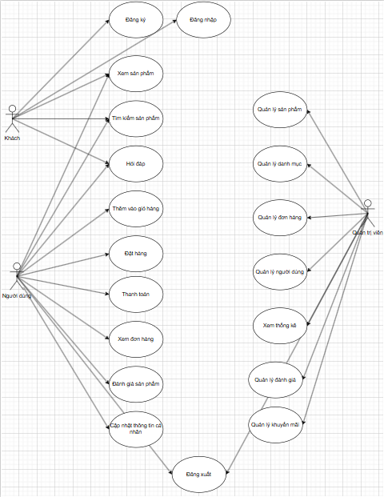

# 🎮 BaDaShop_Gaming

Website bán phụ kiện gaming

---

## 👥 Thành viên

* Hà Phú Đạt - 21130018
* Võ Khương Đại Bảo - 21130284

---

## 📌 Giới thiệu

**BaDaShop_Gaming** là website thương mại điện tử đơn giản chuyên bán phụ kiện gaming như:

* Tai nghe gaming
* Chuột, bàn phím
* Tay cầm chơi game
* Phụ kiện điện thoại

Dự án được xây dựng phục vụ cho đồ án môn **Chuyên Đề Web**, với mục tiêu:

* Áp dụng mô hình **MVC**
* Xây dựng **RESTful API**
* Kết nối **Frontend (ReactJS)** và **Backend (Spring Boot)**
* Thiết kế và thao tác với **MySQL Database**

---

## 🛠️ Công nghệ sử dụng

### 🔹 Frontend

* HTML, CSS, JavaScript
* ReactJS
* Bootstrap 5
* Axios

### 🔹 Backend

* Java Spring Boot
* Spring Data JPA
* Spring Security
* REST API

### 🔹 Database

* MySQL

### 🔹 Công cụ

* XAMPP
* Navicat Lite
* Git & GitHub

---

## 🗺️ Sitemap

### 🔸 Guest (Khách)

* Home → `/`
* Shop (Danh sách sản phẩm) → `/shop`
* Product Detail → `/product/{id}`
* Search → `/search`
* Login → `/login`
* Register → `/register`

---

### 🔸 User (Đã đăng nhập)

* Cart → `/cart`
* Checkout → `/checkout`
* Order History → `/orders`
* Profile → `/profile`

---

### 🔸 Admin

* Dashboard → `/admin`
* Products → `/admin/products`
* Categories → `/admin/categories`
* Orders → `/admin/orders`
* Users → `/admin/users`
* Statistics → `/admin/statistics`

---

## 🌳 Sitemap Structure

```
/
│
├── shop
│   └── product/{id}
│
├── search
├── cart
│
├── login
├── register
│
├── profile
├── checkout
│
├── orders
│
└── admin
    ├── products
    ├── categories
    ├── orders
    ├── users
    └── statistics
```

---

## 🎯 Use Case



### 🔹 Guest

* Xem sản phẩm
* Tìm kiếm sản phẩm
* Đăng ký
* Đăng nhập

---

### 🔹 User

* Đăng nhập / Đăng xuất
* Thêm vào giỏ hàng
* Đặt hàng
* Thanh toán
* Xem đơn hàng
* Đánh giá sản phẩm
* Cập nhật thông tin cá nhân

---

### 🔹 Admin

* Quản lý sản phẩm
* Quản lý danh mục
* Quản lý đơn hàng
* Quản lý người dùng
* Quản lý đánh giá
* Quản lý khuyến mãi
* Xem thống kê

---

## 🏗️ Kiến trúc hệ thống

```
ReactJS (Frontend)
        ↓
Axios (API)
        ↓
Spring Boot Controller
        ↓
Service Layer
        ↓
Repository (JPA)
        ↓
MySQL Database
```

---

## 🎯 Mục tiêu đồ án

* Xây dựng website bán hàng hoạt động được
* Có đầy đủ Frontend + Backend + Database
* Áp dụng REST API
* Quản lý source code bằng GitHub

---

## 🚧 Trạng thái dự án

* Đang phát triển

---

## 🔗 Repository

GitHub:
https://github.com/haphudat/BaDaShop_Gaming
